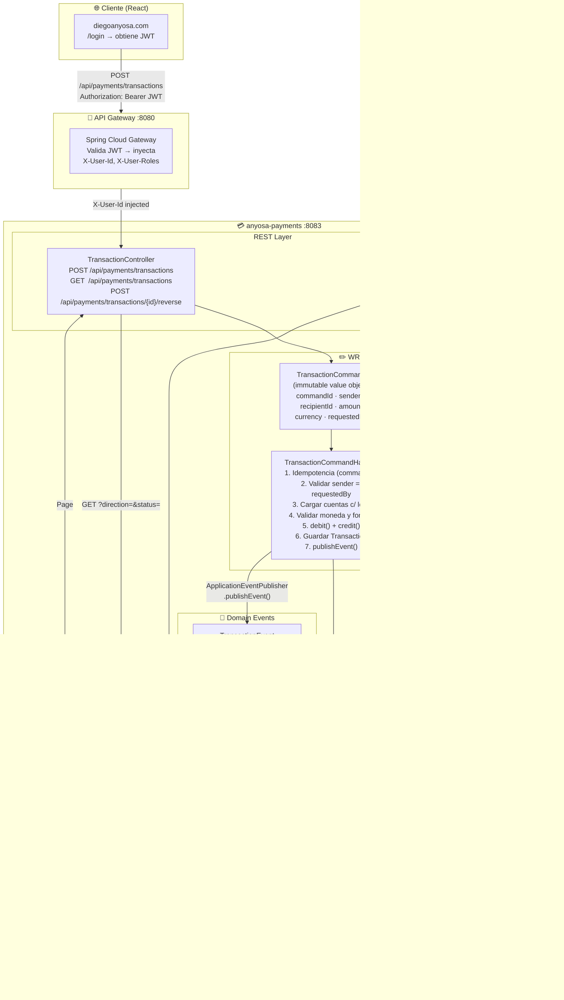
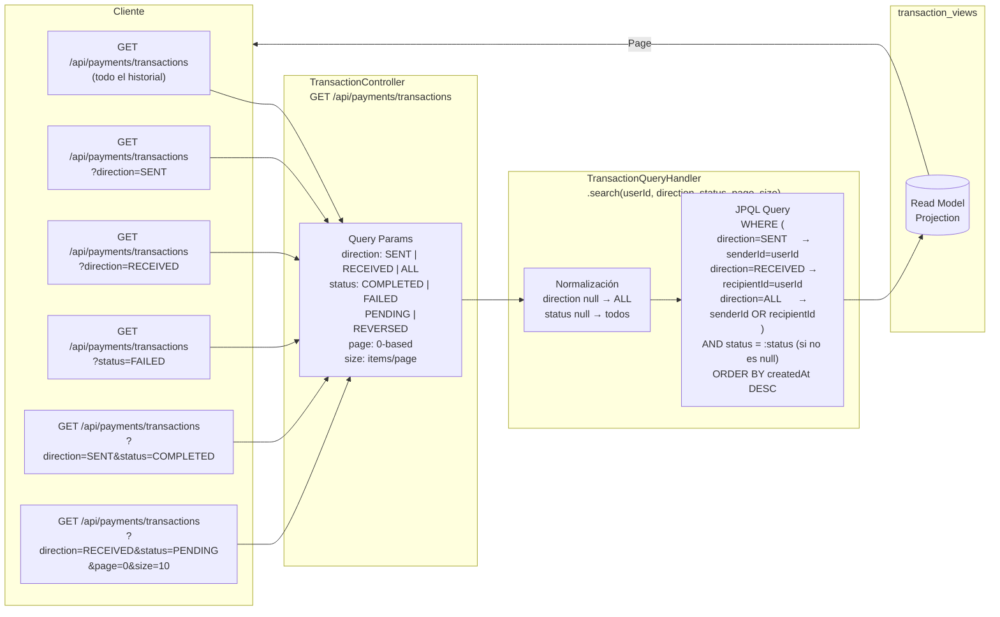
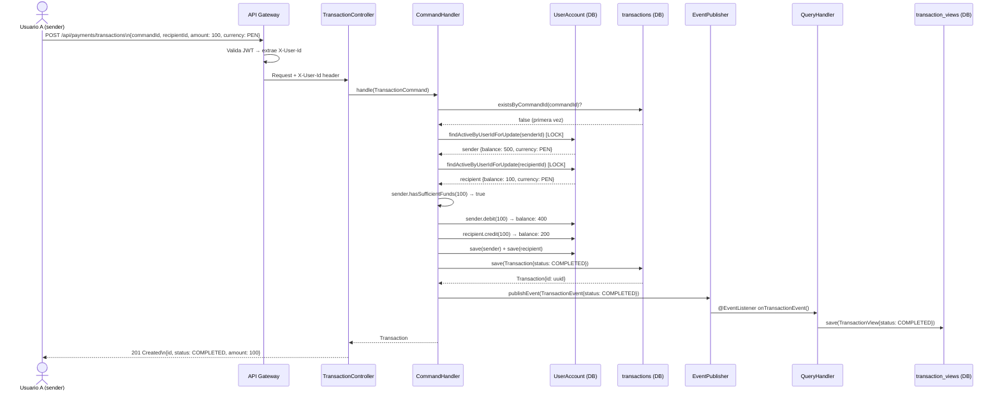
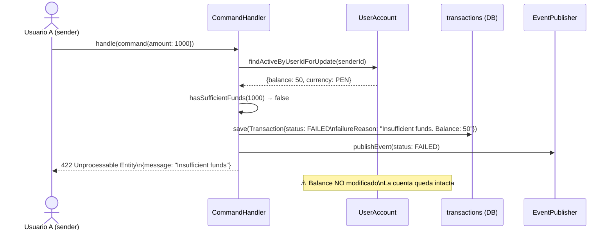
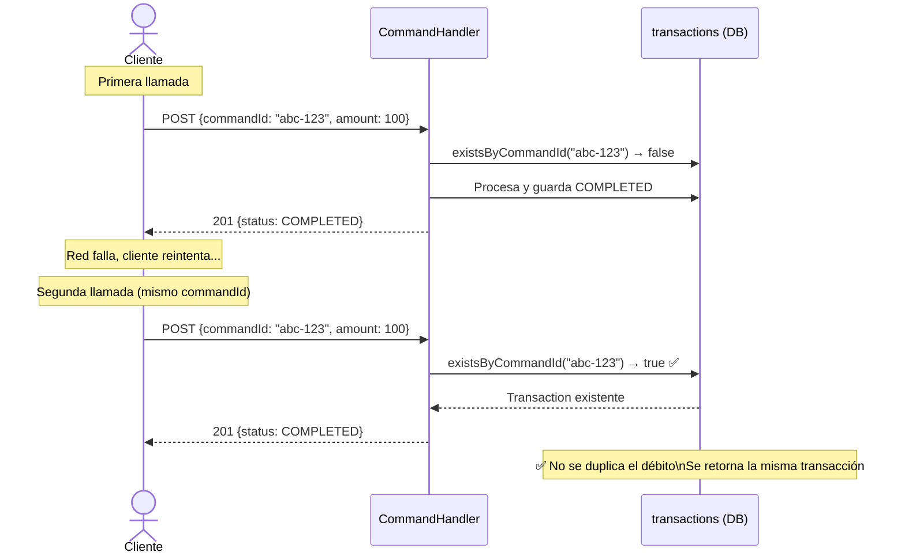
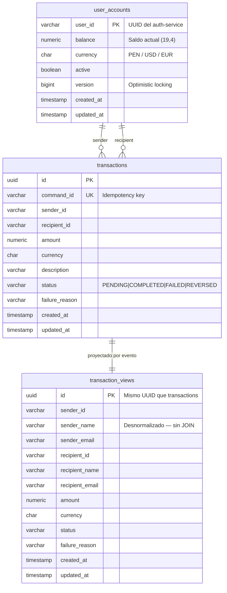

# anyosa-payments — Arquitectura CQRS

## Diagrama 1 — Flujo completo CQRS

---

## Diagrama 2 — API unificada de búsqueda

---

## Diagrama 3 — Flujo de una transferencia exitosa

---

## Diagrama 4 — Flujo de fondos insuficientes

---

## Diagrama 5 — Idempotencia (reintento del cliente)

---

## Diagrama 6 — Estructura de datos CQRS

